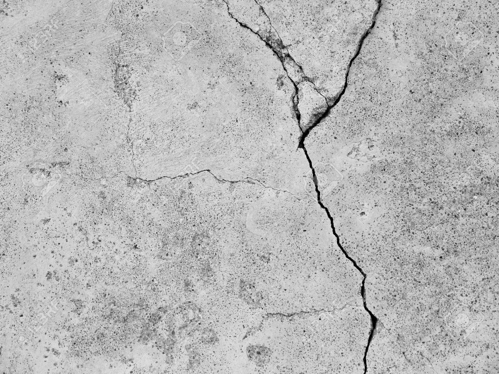

# road_surface_cracks_in_cv_label
Slits, map cracks, are ofen seen on the destroying roads/streets.   

From the image enhancement of  yolo trainging, objects will change angles, colors and brightness etc, in training.
https://github.com/AlexeyAB/darknet/blob/master/cfg/yolov4-csp-swish.cfg#:~:text=angle%3D0,hue%3D.1tra  
So, what we can do is to find similarities of these kinds of crack. Such that Slits can be seen the gather of lines, map cracks has the lines and nodes.
